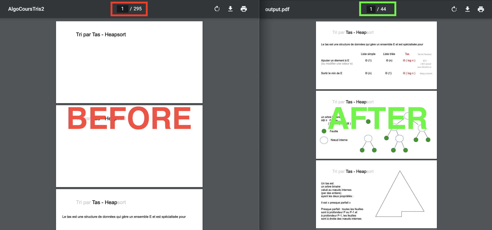

#  Sanatize PDF

> Quickly remove useless page from a huge pdf to get a readable pdf.

  

## Table of Contents

- [Installation](#installation)
- [Usage](#usage)
- [Example](#example)
- [Contributing](#contributing)
- [License](#license)

---

## Installation

```bash
git clone https://github.com/lucasmrdt/sanatize-pdf
cd sanatize-pdf
pip install -r requirements.txt --user
```

## Usage

```bash
> ./sanatize-pdf input_file.pdf output_file.pdf
```

## Example

```bash
> ./sanatize-pdf my_huge_file.pdf my_readable_file.pdf
✅  Your file has been optimized at my_readable_file.pdf
```

---

## Contributing

- [x] Test on mac
- [ ] Test on windows

Fell free to add more usefull features, test it and report issues.

## Support

Reach out to me at one of the following places!

- Website at <a href="https://lucas-marandat.fr" target="_blank">`lucas-marandat.fr`</a>
- LinkedIn at <a href="https://www.linkedin.com/in/lucasmrdt/" target="_blank">`@lucasmrdt`</a>

## License

[](http://badges.mit-license.org)

- **[MIT license](http://opensource.org/licenses/mit-license.php)**
